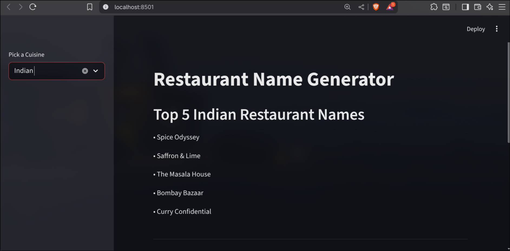
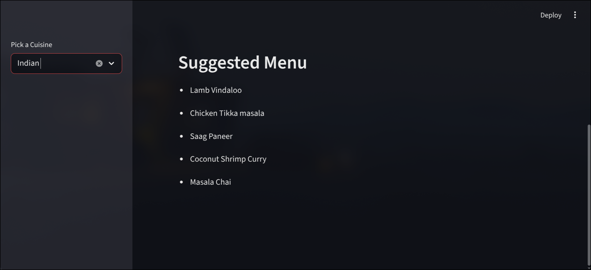

# 🍽️ GenAI Restaurant Name & Menu Generator


**A Generative AI application that helps entrepreneurs brainstorm restaurant concepts using Local LLMs.**

This project leverages **LangChain** sequential chains and **Google's Gemma 2B** model (running locally via Ollama) to generate creative restaurant names and curated menu items based on a selected cuisine.

---

## 📸 Project Demo





---

## 🚀 Features

* **Cuisine Selection:** Choose from Indian, Italian, Chinese, Mexican, Arabic, or American.
* **Creative Naming:** Generates 5 distinct, fancy restaurant names using One-Shot Prompting.
* **Menu Curation:** Context-aware menu generation based on the generated restaurant names.
* **Local Inference:** Runs entirely offline using Ollama, ensuring data privacy and zero API costs.
* **Interactive UI:** Built with Streamlit for a clean, responsive web experience.

---

## 🛠️ Tech Stack

* **Frontend:** [Streamlit](https://streamlit.io/)
* **LLM Orchestration:** [LangChain](https://python.langchain.com/)
* **Model Provider:** [Ollama](https://ollama.com/)
* **LLM Model:** `gemma2:2b` (Lightweight & Efficient)
* **Language:** Python

---

## ⚙️ Installation & Setup

### 1. Prerequisites
Ensure you have Python installed. You also need **Ollama** running locally.

* **Install Ollama:** Download from [ollama.com](https://ollama.com)
* **Pull the Model:** Open your terminal/command prompt and run:
    ```bash
    ollama pull gemma2:2b
    ```

### 2. Clone the Repository
```bash
git clone [https://github.com/YOUR_USERNAME/restaurant-name-generator.git](https://github.com/YOUR_USERNAME/restaurant-name-generator.git)
cd restaurant-name-generator